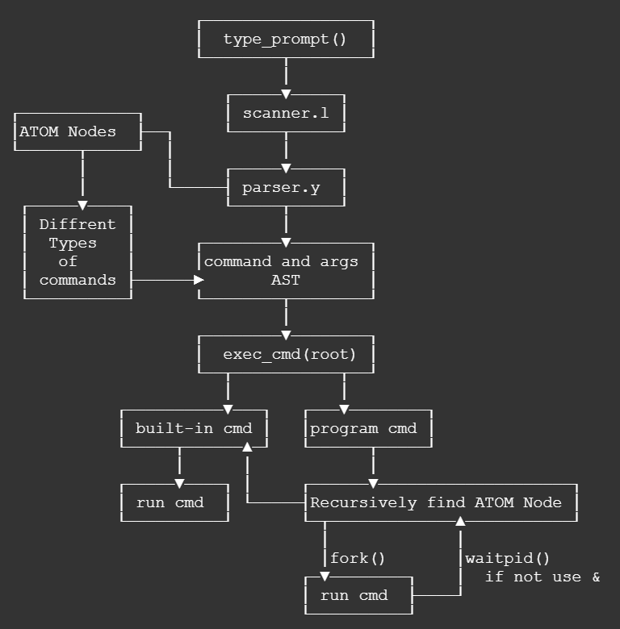
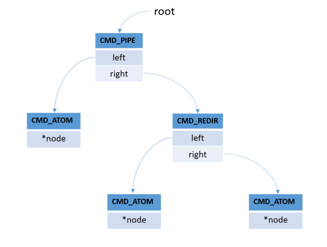
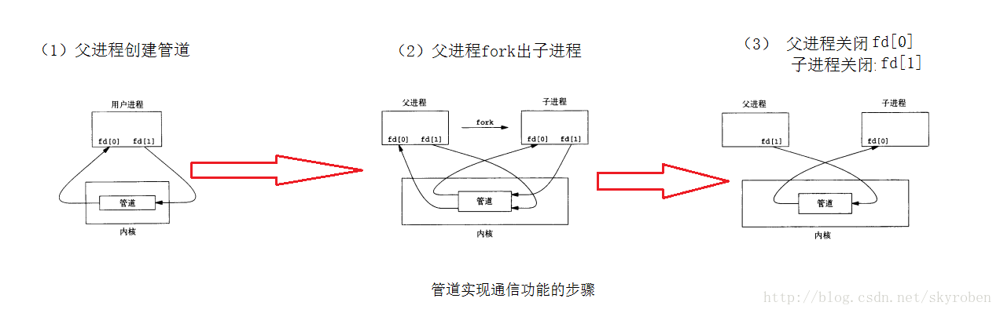
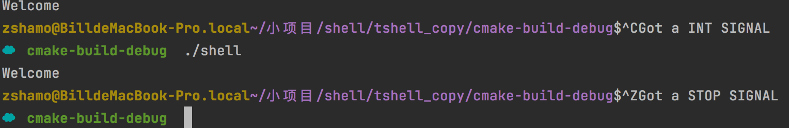

# miniShell
课程实验

### 已实现功能

- 内建命令：`cd/about/history/exit/quit`，`history`命令只能带参数执行
### 主要文件

- `main.c`主函数
- `main.h`主函数的头文件，包含大部分函数声明
- `scanner.l`使用`flex`编写的规则
- `parser.y`使用`bison`分词器
- `read_cmd`包含命令树构建的代码
- `type_prompt.c`生成命令行开头的提示符
- `exec_cmd.c`包含主函数执行的执行命令函数和具体操作的执行命令函数
- `builtin_cmd.c`包含比较复杂的内建命令实现，比如`cd`\`history`
- `sig_handle.c`包含简单的信号处理函数
# Shell简介
### 什么是Shell
Shell通常指命令行界面的解析器，是OS中提供访问内核来提供服务的程序。Shell一般通过系统调用的方式为用户提供和内核的交互。
### 常见的Shell

- bash: 是GNU的Bourne Again Shell，是GNU操作系统上默认的Shell
- Korn Shell: 是对Bourne Shell的发展，在大部分内容上与Bourne Shell(Bash)兼容
- C Shell: 是SUN公司Shell的BSD版本
- Z Shell: Z是最后一个字母,也就是终极Shell。它集成了Bash ksh的重要特性，同时又增加了自己独有的特性。
### 简易Shell功能

1. Shell解释器是一个程序，接受用户输入
2. 分析输入的字符串
3. 分割出命令和参数
4. 根据命令类型执行
   1. 自建命令直接执行
   2. PATH中的命令使用`fork()`出的子进程执行。
   3. 管道`|`输入输出重定向`<``>`
5. 每次命令输入显示当前用户与路径。
# 主要框架设计
### 基本执行逻辑
```c
#define TRUE 1
while(TRUE){
    //1. 显示用户名路径
	type_prompt();
    //2. 读取命令并解析
    read_command(command,parameters);
	//3. 创建子进程执行
    if(fork()!=0)
    	waitpid(-1,&status,0);
    else
       	execve(command,parameters,0);
}
```
### 设计框架

1. `type_prompt()`命令提示符
2. `scanner.l`将正则表达式与语法匹配
3. 每次输入使用`parser（）`解析，`parser.y`解析命令行，将与正则表达式匹配的语法和命令行语法匹配，构造`AST`。
4. 从根节点开始递归语法树，根据不同命令类型进行不同处理。


### 输出shell提示符
输出符由`type_prompt()`函数实现，由文件`type_promp.c`实现。
提示符主要由`用户名`、`主机名`和`路径`组成，其中在用户目录下则路径化简为`~`，`root`用户显示`$`。
#### 基本实现思路

- `getpwuid(getuid())`获取当前pwd结构变量。
```c
struct passwd {
	char	*pw_name;		/* user name */
	char	*pw_passwd;		/* encrypted password */
	uid_t	pw_uid;			/* user uid */
	gid_t	pw_gid;			/* user gid */
	__darwin_time_t pw_change;		/* password change time */
	char	*pw_class;		/* user access class */
	char	*pw_gecos;		/* Honeywell login info */
	char	*pw_dir;		/* home directory */
	char	*pw_shell;		/* default shell */
	__darwin_time_t pw_expire;		/* account expiration */
};
```

- 用户名`pw_name`获取
- 主机名`gethostname()`获取
- 路径名通过`getcwd()`获得，**并且考虑**`**~**`**的路径压缩**（如果该路径在用户路径下则压缩）
- 最后根据`uid`判断普通用户使用`$`提示符，`root`用户使用`#`提示符。
#### 代码
```c
//
// Created by tbb on 2021/12/5.
//
#include "main.h"

char hostName[max_name_len];
char pathName[max_path_len];

void type_prompt(void){
    char prompt[MAX_PROMPT];

    //getuid()获取真实的用户识别码
    //getpwuid()从密码文件中取得指定uid的数据
    pwd = getpwuid(getuid());
    //获取当前的工作目录
    getcwd(pathName, max_path_len);

    //输出用户名
    if(gethostname(hostName, max_name_len) == 0)
        sprintf(prompt,"\033[1;33mT_bb_%s@%s:\033[1;33m",pwd->pw_name,hostName);
    else
        sprintf(prompt,"\033[1;33mT_bb_%s@unknown:\033[1;33m",pwd->pw_name);

    //~展开为$HOME值,pw_dir即home directory。如果当前路径比$HOME长且在HOME下，则将HOME替换为~
    unsigned prompt_len = strlen(prompt);
    unsigned pw_dir_len = strlen(pwd->pw_dir);
    if(strlen(pathName) < pw_dir_len ||
       strncmp(pathName, pwd->pw_dir, pw_dir_len) != 0)
        sprintf(prompt + prompt_len, "\033[0;35m%s\033[0m", pathName);
    else
        //进入用户目录下，路径显示~
        sprintf(prompt + prompt_len, "\033[0;35m~%s\033[0m", pathName + pw_dir_len);

    prompt_len = strlen(prompt);

    //geteuid()获取有效的用户识别码 root的uid为0
    if(geteuid() == 0)
        //root用户
        snprintf(prompt+prompt_len, 2, "#");
    else
        //非root
        snprintf(prompt+prompt_len, 2, "$");

    printf("%s", prompt);
}
```
### 构建语法树
### flex
`flex`是用于生成扫描器的工具。 扫描器是识别文本中的词汇模式的程序。
`flex`描述采用成对的正则表达式和C代码（称为规则）的形式。 默认情况下会生成一个C源文件`lex.yy.c`作为输出，该文件定义了例程`yylex()`。 可以编译此文件并将其与`flex`运行时库链接以生成可执行文件。 运行可执行文件时，它将分析其输入以查找与正则表达式的匹配。 只要找到一个，它就会执行相应的C代码。
具体而言，在`scanner.l`中，定义了文件结束符`EOF`和描述命令与参数的正则表达式
```c
%%
<<EOF>>     {return 0;}
"&"|";"|"|" {return yytext[0];}
">>"        {return yytext[0];}
">"         {return yytext[0];}
"<"         {return yytext[0];}
"\n"        {return yytext[0];}
[ ]*        {}
{ID}+       {yylval = strdup(yytext); return T_ARG;}
.           {printf("lex err:[%s]", yytext); return 0;}
%%
```
### bison
`bison`是一个语法分析器的生成器，`bison`和 `flex`配合使用，它可以将用户提供的语法规则转化成一个语法分析器。简单来说，通过给定语法的产生式开始，`bison`会通过算法，最终构造得到动作表，然后利用这个动作表去解析句子。具体来说，`bison`读取用户提供的语法的产生式，生成一个 C 语言格式的` LALR(1) `动作表，并将其包含进一个名为`yyparse()`的 C 函数，这个函数的作用就是利用这个动作表来解析 `token`流 ，而这个`token`流是由`flex`生成的词法分析器扫描源程序得到的。
在`parser.y`文件中需要包含对命令结点的定义和构造函数的声明，还需要包含其他操作需要用到的头文件，并对后面用到的变量进行声明。
```c
%{
//#define YYSTYPE
#include <stdio.h>
#include <string.h>
#include <stdlib.h>
#include "main.h"

int yylex();
void yyerror(const char* msg);

cmd_t cmd;
extern cmd_t root;
%}
```
后面主要定义了符号的结合性与动作表
```c
%left '|' ';'
%left '<'
%left '&'
%left '>'
%left ">>"

%%
line            :  command '\n'	    		{ root = $1; $$ = 0; return 0; }
		        | '\n'       		        { root = 0; $$ = 0; return 0; }
                ;

command	        :  basic_command		    { $$ = $1;}
		        |  command ';' command  	{ $$ = cmd_list_new($1, $3);}
		        |  command '&'			    { $$ = cmd_back_new($1);}
		        |  command '|' command 		{ $$ = cmd_pipe_new($1, $3);}
		        |  command '<' command      { $$ = cmd_redi_new($1, $3, 0);}
		        |  command '>' command		{ $$ = cmd_redo_new($1, $3, 1);}
		        |  command ">>" command     { $$ = cmd_redor_new($1, $3, 1);}
		        ;

basic_command   :  T_ARG args			    { struct Node *t = make_node($1, $2); $$ = cmd_atom_new(t);}
		        ;

args		    : T_ARG args			    { $$ = make_node($1, $2);}
		        |                           { $$ = (struct Node *)0;}
		        ;
%%
```
### AST
#### 基本流程
写好相应的构造函数`cmd_atom_new()`
```c
cmd_t cmd_atom_new(struct Node *node){
    cmd_atom cmd;
    NEW(cmd);
    cmd->type = CMD_ATOM;
    cmd->node = node;
    return (cmd_t)cmd;
}
```
由`parser.y`来解析匹配和自行调用
```c
basic_command   :  T_ARG args			    { struct Node *t = make_node($1, $2); $$ = cmd_atom_new(t);}
```
` cat hello.txt | grep -n hello > c.txt `命令生成如下抽象语法树，它们的叶子节点是基本命令。

#### 构造
shell使用了多种不同类型的命令，可以分为：

- 原子型，可以直接前往执行的命令
- 后台型，使用了`&`进行标记，使命令在后台运行
- 列表型，使用了`;`间隔多个命令，这些命令需要一次执行
- 管道型，使用`|`标记，将左侧的命令结果作为右侧命令的输入
- 输入重定向，使用了`<`将右侧文件内容作为左侧命令的输入
- 输出重定向，使用了`>`将左侧命令输出到右侧文件
- 输出重定向追加，未完成。

使用枚举来表示不同命令类型，节省空间。
```c
enum cmd_type_t{
    CMD_ATOM,
    CMD_BACK,
    CMD_LIST,
    CMD_PIPE,
    CMD_REDI,
    CMD_REDO,
    CMD_REDOR
};
```
将枚举类放入结构体中来标记类型，用于判断如`if(_root->type == CMD_ATOM){}`
```c
//basic cmd
typedef struct Cmd_atom{
    enum cmd_type_t type;
    struct Node *node;
}Cmd_atom, *cmd_atom;
cmd_t cmd_atom_new(struct Node *);
```
### 命令历史的保存
命令的历史保存要开辟一块缓存区域，我设置的区域大小是[50][128]的，将这块区域作为环形缓冲区，设置一个`history_cnt`记录目前缓冲区中的命令数和一个`history_queue_start`记录目前缓冲区的起始位置。
在`save_history(root)`函数中，处理以上两个变量并计算当前可以记录的位置`cur_line`，将当前可以记录的位置使用`memset()`清空，并调用`write2history()`递归遍历当前的命令树并将记录命令和参数的`Node`链表中的字符串追加写入缓冲区。
```c
char history_buff[50][128] = {};
int history_cnt = 0;
int history_queue_start = 0;

//...

void save_history(cmd_t _root){
    int cur_line;
    if(history_cnt == 50){
        cur_line = history_queue_start;
        ++history_queue_start;
        history_queue_start %= 50;
    }else{
        cur_line = history_cnt % 50;
        ++history_cnt;
    }

    memset(history_buff[cur_line], 0, sizeof(history_buff[cur_line]));
    write2history(_root, cur_line);
}
```
要注意使用`snprinrf()`前获取的字符串长度有没有作废，如果字符串发生了修改，需要重新获取字符串长度。
# 命令实现
### 基本命令实现
字符串【写入地址+/+打开文件】传入`execv`函数。执行`usr/bin`下面的程序，并通过`arg[]`传输对应参数。
```c
case CMD_ATOM: {
    char *arg[10] = {0};
    int i = 0;
    struct Cmd_Atom *t = (struct Cmd_Atom *) cmd;
    struct node *node = t->node;
    while (node) {
        arg[i] = node->data;
        node = node->next;
        i++;
    }
    char *root = "/bin/";
    char binPath[50];
    strcpy(binPath, root);
    strcat(binPath, arg[0]);
    if (execv(binPath, arg) == -1) {
        char *path = "/usr/bin/";
        char usrBinPath[50];
        strcpy(usrBinPath, path);
        strcat(usrBinPath, arg[0]);
        if (execv(usrBinPath, arg) == -1) {
            fprintf(stderr, "cannot run command, check your input.\n");
        }
    }
    break;
}
```
### List实现
保证执行从左到右。
```c
case CMD_LIST:{
    cmd_list t = (cmd_list)cmd;
    cmd_t left = t->left;
    cmd_t right = t->right;
    switch(pid = fork()){
        case -1: {
            printf("fork failed.\n");
            perror("fork()");
            exit(1);
        }
        case 0:{
            cmd_run(left);
            printf("List Command Error\n");
            exit(1);
        }
        default:{
            int status;
            //保证子进程执行完毕再执行父进程
            waitpid(pid, &status, 0);
            cmd_run(right);
            int err = WEXITSTATUS(status);
            if(err)
                printf("Error: %s\n", strerror(err));
        }
    }
    break;
}
```
### Background实现
将子进程托管给init，父进程结束。
子进程是需要父进程回收的，通常子进程结束由父进程回收，父进程再结束。如果没有回收，则子进程成为僵尸进程，僵尸进程由init进程即操作系统管理。
> 僵尸进程的处理方法：1. 父进程捕获子进程发送的`SIGCHLD`信号，显式调用`wait`2. `signal(SIGCHLD,SIG_IGN)`，子进程直接退出。[参考](https://cloud.tencent.com/developer/article/1356655)

这里执行完else之后，主进程迅速结束，子进程托管给init进程并设置`signal(SIGCHLD, SIG_IGN);`，在执行完cmd_run(back)之后自行结束，达到后台运行的效果。

- `signal(SIGCHLD, SIG_IGN);`
```c
if (fork() == 0) {
    //忽略子进程信号，将其托管给操作系统
    signal(SIGCHLD, SIG_IGN);
    cmd_run(_back);
} else {
    exit(0);
}
```

- 守护进程
```c
case CMD_BACK: {
    struct Cmd_Back *t = (struct Cmd_Back *) cmd;

    Cmd_t back = t->back;
    daemon(0, 0);
    Cmd_run(back);
    break;
}
```
### Pipe实现
#### 标准输入输出
文件描述符就是一个小整数。默认的3个缺省打开的文件描述符
0：标准输入 键盘
1：标准输出 显示器
2：标准错误 显示器
#### 实现
`grep "error" minicom.log | awk '{print $1}'`
在Shell中要实现这样的效果，有4个步骤：

1. 创建pipe
2. fork两个子进程执行grep和awk命令
3. 把grep子进程的标准输出、标准错误重定向到管道数据入口
4. 把awk子进程的标准输入重定向到管道数据出口
```c
case CMD_PIPE: {
    struct Cmd_Pipe *t = (struct Cmd_Pipe *) cmd;
    Cmd_t left = t->left;
    Cmd_t right = t->right;

    int pd[2];
    //创建管道读和写都是指向自己
    pipe(pd);
    //fork使得父子进程都有指向自己的读和写描述符，但公用同一个块缓冲区
    pid_t pid = fork();
    if (pid == 0) {                     // 子进程写管道
        close(pd[0]);                   // 关闭子进程的读端，没有输入
        dup2(pd[1], STDOUT_FILENO);     // 将子进程的写端作为标准输出
        Cmd_run(left);
    } else {                              // 父进程读管道
        /*关键代码
         子进程写管道完毕后再执行父进程读管道,
         所以需要用wait函数等待子进程返回后再操作*/
        int status;
        waitpid(pid, &status, 0);       // 等待子进程返回
        close(pd[1]);                    // 关闭父进程管道的写端，没有输出
        dup2(pd[0], STDIN_FILENO);       // 管道读端读到的重定向为标准输入
        Cmd_run(right);
    }
    break;
}
```

### Redir >
#### DUP2
> 在 dup2（） 中，指定了新描述符 fildes2 的值。 如果 fildes 和 fildes2 相等，则 dup2（） 只返回 fildes2;不会对现有描述符进行其他更改。 否则，如果描述符 fildes2 已在使用中，则首先取消分配它，就好像首先执行了 close（2） 调用一样。

`dup2(fdw, fd);`，_调用dup2(fd, STDOUT_FILENO)将某个打开文件的文件描述fd映射到标准输出。_即将fdw映射到fd。
#### 实现

1. 获取右边节点信息，根据文件名，创建写文件描述符fdw
2. 获取节点的描述符fd，将写文件描述符fdw映射为写描述fd。`dup2(fdw, fd);`
3. 运行左节点命令，并且将输出写入到创建好的fdw中。
```c
case CMD_REDIR: {
    struct Cmd_Redir *t = (struct Cmd_Redir *) cmd;
    Cmd_t left = t->left;
    Cmd_t right = t->right;
    //{ (yyval.cmd) = Cmd_Redir_new((yyvsp[(1) - (3)].cmd), (yyvsp[(3) - (3)].cmd), 1);;}
    //解析器里面给fd赋值1，STDOUT
    int fd = t->fd;
    //关闭fd标准输出，后面的open刚好分配最小值，fdw=1指向写入。close和dup2二选一即可
    //close(fd);

    //获取右边文件名，创建/写入文件
    struct Cmd_Atom *right_node = (struct Cmd_Atom *) right;
    //0644对应权限：-rw-r--r--
    int fdw = open((const char *) right_node->node->data, O_CREAT | O_RDWR,0644);
    //printf("fd:%d fdw:%d\n",fd,fdw);
    dup2(fdw, fd);
    //printf("fd:%d fdw:%d\n",fd,fdw);
    Cmd_run(left);

    close(fd);
    close(fdw);
    break;
}
```
#### 细节
关于close(fd)这里的细节：

- 在解析器中，给fd=1，标准输出。
- close(fd)并且之后open创建fdw，会导致fdw=1，即open是从最小的数字开始创建。fdw=1刚好对应标准输出，所以即使没有dup2，也可以正常写入。

[http://c.biancheng.net/view/5956.html](http://c.biancheng.net/view/5956.html)
#### 追加输入
对于  `a >> b.txt`追加输入，设置`fd = open(File, O_WRONLY|O_APPEND|O_CREAT|O_APPEND, 0777);`即可
### 信号处理

#### 实现
通过`signal(sig,sig_handle)`绑定接受到的信号和信号处理函数，如
```c
int main() {
    //...
    signal(SIGINT, sigint_handler);
    signal(SIGTSTP, sigtstp_handler);
    while(1){
        //...
    }
```
为`SIGINT ctrl+c`和`SIGTSTP ctrl+z`设置了处理函数。
```c
void sigint_handler(int sig){
    printf("Got a INT SIGNAL\n");
    pid_t pid = getpid();
    if(pid != 0)
        //并将收到的信号转发到进程组中PID绝对值与当前进程相同的进程，最后退出进程。?????
        kill(-pid, sig);
    exit(0);
}
void sigtstp_handler(int sig){
    printf("Got a STOP SIGNAL\n");
    pid_t pid = getpid();
    if(pid != 0)
        kill(-pid, sig);
    exit(0);
}

```
对于收到的信号，期望的行为是：仅终止当前进程，并不终止父进程，因此我选择了在程序执行函数exec_cmd()中修改fork()后的分支，为父进程添加信号忽略。之所以选择信号忽略而不是信号屏蔽，首要原因是这是信号的简易处理，并且没有**设置前后台队列，难以区分前后台**；其次是因为对于信号屏蔽来说，**被屏蔽的信号在解除屏蔽后还会执行**一次，因此父进程在接触屏蔽后依然会立即被终止。
# 遇到的问题
### 词法分析器
不熟悉词法分析器，不好进行扩展。
